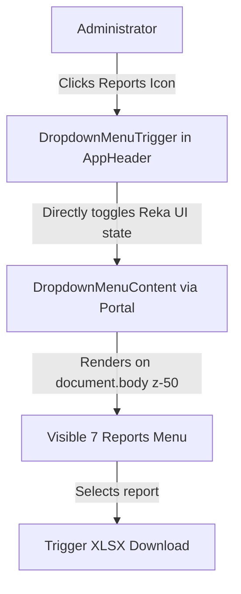

# Requirements

### Overview & Goals
Fix the visibility and interaction issue with the reports dropdown menu in the navigation header so that clicking the reports icon reliably displays the dropdown list of available downloads without being blocked, hidden, or immediately closed by event/focus conflicts or overlay stacking.

### Scope
#### In Scope
- **Dropdown Trigger Conflict Resolution**: Remove the conflicting nested `TooltipTrigger` / `TooltipProvider` wrapping `DropdownMenuTrigger as-child` in `AppHeader.vue`, aligning it with the working dropdown patterns used in the header avatar and selection switcher.
- **Layering & Visibility Verification**: Ensure `DropdownMenuContent` maintains proper z-index (`z-50`), portal rendering, and visible boundaries across desktop and responsive navigation states.
- **Accessibility & Tooltip Experience**: Retain accessible labeling (`aria-label="Relatórios"` and `title="Relatórios"`) on the trigger button so users get native hover tooltips without component event collisions.
- **Regression Testing**: Verify frontend build and existing feature test suite.

#### Out of Scope
- Modifying backend report exports or routes.
- Redesigning unrelated dropdown menus or table layouts.

### User Stories
- **As an Administrator**, I want to click the reports icon in the top header and immediately see the dropdown menu with all 7 download options, so that I can download any report with a single click.

### Functional Requirements
- **FR-1**: Clicking the reports button in `AppHeader.vue` must open the `DropdownMenuContent` list showing all 7 reports.
- **FR-2**: The dropdown menu must remain open and interactive until a report is selected or the user clicks outside.
- **FR-3**: Selecting any report from the dropdown triggers the file download.
- **FR-4**: The trigger button must retain accessible labeling (`aria-label` and `title`).

### Non-Functional Requirements
- **UX & Performance**: Immediate response to click events with zero event listener hijacking or focus trap issues.
- **Consistency**: Follow the established pattern of `DropdownMenu` and `DropdownMenuTrigger` in `AppHeader.vue` and `SelectionProcessSwitcher.vue`.

# Technical Design

### Current Implementation
- In `AppHeader.vue`, the reports dropdown was wrapped inside `<TooltipProvider>` and `<Tooltip>` with `<TooltipTrigger as-child><DropdownMenuTrigger as-child><Button>`.
- In Reka UI (radix-vue), nesting `TooltipTrigger as-child` directly around `DropdownMenuTrigger as-child` causes event listener and focus management collisions (`pointerdown`, `focus`, `blur`). When the trigger is clicked, the tooltip triggers a re-focus/blur cycle that instantly closes the dropdown menu or prevents the open state from applying.
- In contrast, working dropdowns in the app (such as the user profile menu at line 538 in `AppHeader.vue` and `SelectionProcessSwitcher.vue`) directly wrap `<Button>` with `<DropdownMenuTrigger as-child>` without an intermediary `TooltipTrigger`.

### Key Decisions
- **Eliminate Nested Trigger Collisions**: Remove the `Tooltip` / `TooltipProvider` wrapper around `DropdownMenuTrigger` in `AppHeader.vue`. Provide hover affordance via native `title="Relatórios"` and `aria-label="Relatórios"` on the `<Button>`.
- **Preserve Portal & Z-Index Layering**: Keep `DropdownMenuPortal` in `DropdownMenuContent.vue` which teleports to `document.body` with `z-50`, ensuring header `overflow` or parent stacking contexts cannot clip the menu.

### Proposed Changes
1. **`resources/js/components/AppHeader.vue`**:
   - Refactor the desktop reports dropdown to use `<DropdownMenuTrigger as-child>` directly on the `<Button class="group h-9 w-9 cursor-pointer" aria-label="Relatórios" title="Relatórios">`.
   - Remove `<TooltipProvider>`, `<Tooltip>`, and `<TooltipContent>` wrapping the dropdown trigger.
   - Ensure the dropdown content renders with standard alignment (`align="end"`) and styling.

### Architecture Diagram

### File Structure
- `resources/js/components/AppHeader.vue` (Modified)

### Risks & Mitigations
- **Accessibility on hover**: Adding native HTML `title="Relatórios"` ensures mouse users still see a tooltip label without introducing Vue event listener conflicts.

# Testing

### Validation Approach
Verify menu trigger and visibility through Vite build compilation, browser inspection, and running the Pest test suite to ensure no regressions in report endpoints.

### Key Scenarios
1. **Dropdown Trigger Interaction**: Clicking the reports icon in the desktop header smoothly toggles the menu open and closed.
2. **Menu Item Selection**: Clicking a report item opens the file download URL and closes the menu appropriately.
3. **Mobile Drawer**: Verify mobile drawer report links remain functional and styled consistently.

### Test Changes
- Run `npm run build` to confirm Vue/Vite compile cleanly.
- Run `php artisan test --compact --filter=Report` to ensure all report routes continue passing.

# Delivery Steps

### ✓ Step 1: Fix Reports Dropdown Trigger in AppHeader
Refactor the reports dropdown button in `AppHeader.vue` to eliminate `TooltipTrigger` nesting conflicts and ensure reliable menu opening.

- Remove `<TooltipProvider>`, `<Tooltip>`, and `<TooltipContent>` wrapping the `<DropdownMenuTrigger>` in `resources/js/components/AppHeader.vue`.
- Bind `<DropdownMenuTrigger as-child>` directly to the `<Button>` component with `aria-label="Relatórios"` and `title="Relatórios"`.
- Verify `DropdownMenuContent` styling, alignment, and portal rendering.

### ✓ Step 2: Validate Frontend Build and Automated Tests
Verify that the UI builds without errors and the full test suite passes.

- Run `npm run build` to verify Vite bundle compilation.
- Run `php artisan test --compact --filter=Report` to verify backend report endpoints remain functional.
- Run `vendor/bin/pint --format agent` to maintain code formatting standards.