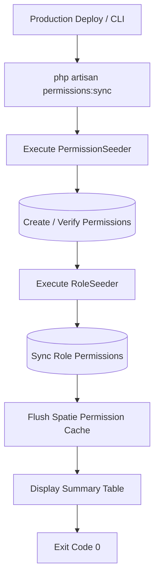

# Requirements

### Overview & Goals
Provide a safe, idempotent Artisan console command (`php artisan permissions:sync`) to synchronize all system permissions and role mappings in production environments following recent updates (such as granting `projects.view` to `master_committee` and `doctorate_committee`). The command must ensure all required permissions exist, roles receive their updated permission matrices, and Spatie's permission cache is immediately flushed.

### Scope
- **In Scope:**
  - Creating an Artisan command `app/Console/Commands/SyncPermissionsCommand.php` with signature `permissions:sync` (and `app:sync-permissions` alias/description).
  - Calling `PermissionSeeder` to create any missing permissions.
  - Calling `RoleSeeder` to sync the designated permissions for each system role (`admin`, `reviewer`, `master_committee`, `doctorate_committee`).
  - Clearing the Spatie permission cache (`PermissionRegistrar::forgetCachedPermissions()`) so that changes take effect immediately without requiring application restart or manual cache clearing.
  - Providing clear CLI output (informational messages and a summary table showing synchronized roles and their permission counts).
  - Automated feature tests for the command.
- **Out of Scope:**
  - Removing custom user assignments or altering non-permission tables.
  - Modifying business logic in controllers or Vue components.

### User Stories
- **As a System Administrator / DevOps Engineer**, I want to execute a single Artisan command (`php artisan permissions:sync`) during production deployment or maintenance, so that all database permissions and roles are aligned with the latest codebase updates without downtime or data corruption.
- **As a Committee Member**, I want my account permissions to reflect the new capabilities immediately after the deployment command runs, without encountering stale permission cache errors.

### Functional Requirements
1. **Idempotence & Safety:** Running the command multiple times must produce identical results without duplicating permissions, altering user passwords, or removing user-role assignments.
2. **Permission & Role Alignment:**
   - Ensures all system permissions defined in `PermissionSeeder` are present in the `permissions` table.
   - Synchronizes permissions for all core roles defined in `RoleSeeder` (`admin`, `reviewer`, `master_committee`, `doctorate_committee`).
3. **Cache Invalidation:** Calls Spatie's `PermissionRegistrar::forgetCachedPermissions()` to flush all cached permissions across application processes.
4. **Console Feedback:**
   - Displays real-time progress (`info` messages).
   - Displays a clean console table summarizing each role and its synchronized permissions count.
   - Returns exit code 0 (`Command::SUCCESS`).

### Non-Functional Requirements
- **Reliability:** The command must execute cleanly within standard CI/CD deployment pipelines (such as `composer run deploy` or deployment hooks).
- **Code Standards:** Adhere to PHP 8.4 attributes (`#[Signature]`, `#[Description]`), strict types, and Laravel Pint formatting.

# Technical Design

### Current Implementation
- **Permissions Seeder:** `database/seeders/PermissionSeeder.php` registers all valid permissions in the system using `Permission::firstOrCreate(['name' => $permission])`.
- **Roles Seeder:** `database/seeders/RoleSeeder.php` creates standard roles and calls `$role->syncPermissions([...])` to enforce exact permission sets, including the newly added `projects.view` permission for `master_committee` and `doctorate_committee`.
- **Spatie Cache:** Spatie Laravel Permission caches authorization checks. When permissions are modified directly in the database during deployment, cached authorization tokens may remain stale unless `forgetCachedPermissions()` is called.

### Key Decisions
1. **Command Architecture:**
   - *Choice:* Create `app/Console/Commands/SyncPermissionsCommand.php` leveraging `PermissionSeeder` and `RoleSeeder` directly, followed by `app(PermissionRegistrar::class)->forgetCachedPermissions()`.
   - *Rationale:* Eliminates duplication of permission definitions across multiple files, ensuring `PermissionSeeder` and `RoleSeeder` remain the single source of truth for all environments.
2. **Signature & Aliases:**
   - *Choice:* Use `permissions:sync` as primary signature.
   - *Rationale:* Intuitive, matches common Laravel convention, and is easily discovered via `php artisan list`.
3. **Output & Observability:**
   - *Choice:* Render a formatted table in terminal displaying `Role`, `Guard`, and `Permissions Count` alongside confirmation of cache clearance.
   - *Rationale:* Provides immediate visibility and validation for operators running deployments in production.

### Proposed Changes

#### 1. `app/Console/Commands/SyncPermissionsCommand.php`
- Class `SyncPermissionsCommand` extending `Illuminate\Console\Command`.
- Attributes:
  ```php
  #[Signature('permissions:sync')]
  #[Description('Sincroniza todas as permissões e papéis do sistema e limpa o cache de permissões')]
  ```
- Implementation in `handle()`:
  1. Print start message: `"Sincronizando permissões do sistema..."`.
  2. Instantiate and run `PermissionSeeder`: `$this->call(PermissionSeeder::class);` or execute seeder instance.
  3. Instantiate and run `RoleSeeder`: `$this->call(RoleSeeder::class);` or execute seeder instance.
  4. Flush cache: `app(PermissionRegistrar::class)->forgetCachedPermissions();`.
  5. Query roles with `Role::with('permissions')->get()` and output `$this->table(['Papel', 'Guard', 'Permissões'], ...)`.
  6. Output success message: `"Permissões e papéis sincronizados com sucesso!"`.
  7. Return `self::SUCCESS`.

#### 2. `tests/Feature/Console/SyncPermissionsCommandTest.php`
- Test cases covering:
  - Command executes successfully with exit code 0.
  - Creates newly registered permissions in `permissions` table if not already present.
  - Synchronizes updated permissions for `master_committee` and `doctorate_committee` (specifically verifying `projects.view` is attached).
  - Clears Spatie permission cache without errors.
  - Outputs expected role summary table and messages.

### Architecture / Execution Flow


### Risks & Mitigations
- **Risk:** Existing custom permissions assigned to standard roles might get overwritten by seeder sync.
  - *Mitigation:* System roles are strictly code-defined in this application; `syncPermissions` ensures production roles match codebase specifications precisely.
- **Risk:** Stale cached permissions in running workers/octane/redis.
  - *Mitigation:* Calling `forgetCachedPermissions()` directly clears Spatie's cache store.

# Testing

### Validation Approach
Verify via automated Pest feature tests checking database state before and after command execution, asserting console outputs, and testing cache invalidation.

### Key Scenarios
1. **Fresh / Updated Permissions Execution:**
   - Delete a permission or remove `projects.view` from `master_committee` role.
   - Run `php artisan permissions:sync`.
   - Assert exit code 0, assert permission is recreated in DB, and assert `master_committee` has `projects.view`.
2. **Idempotence:**
   - Run `php artisan permissions:sync` twice in a row.
   - Assert no duplicates created and both runs return exit code 0.
3. **Console Output Verification:**
   - Assert console output includes success message and lists synchronized roles (`admin`, `reviewer`, `master_committee`, `doctorate_committee`).

### Test Changes
- Create `tests/Feature/Console/SyncPermissionsCommandTest.php` with tests:
  - `it syncs all permissions and roles successfully`
  - `it grants newly added permissions to existing committee roles in database`
  - `it resets permission cache during execution`

# Delivery Steps

### ✓ Step 1: Create the permissions:sync Artisan command
Implement the `SyncPermissionsCommand` console command to seed permissions, sync roles, clear cache, and output execution summary.

- Create `app/Console/Commands/SyncPermissionsCommand.php` with signature `permissions:sync`.
- Integrate execution of `Database\Seeders\PermissionSeeder` and `Database\Seeders\RoleSeeder`.
- Add explicit call to `app(\Spatie\Permission\PermissionRegistrar::class)->forgetCachedPermissions()`.
- Add console summary table showing synchronized roles and total assigned permissions.

### ✓ Step 2: Add automated tests for the synchronization command
Add comprehensive feature tests ensuring the command safely updates permissions and roles.

- Create `tests/Feature/Console/SyncPermissionsCommandTest.php`.
- Test that missing permissions are created and roles are updated with their expected permissions (including `projects.view` on committee roles).
- Verify console output messages and exit code 0.
- Validate formatting with `vendor/bin/pint --dirty --format agent`.