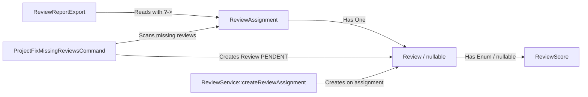

# Requirements

### Overview & Goals
In production, generating the evaluation Excel export (`relatorio-avaliacao-{id}.xlsx`) triggers an `ErrorException: Attempt to read property "score" on null` at `app/Exports/ReviewReportExport.php:24`.

This occurs because:
1. `$project->reviewAssignments` can contain assignments that do not have an associated `Review` record (e.g. evaluators assigned/reassigned after distribution initialization or imported assignments).
2. Even when a `Review` record exists, if the reviewer has not submitted their evaluation yet (status `PENDENT`), `$review->score` is `null`, which causes `$review->score->label()` to fail.

The goal is to:
- Make `ReviewReportExport` completely resilient to missing review records and pending scores.
- Ensure `ReviewResource` is safe against null scores.
- Automatically create `Review` records when new `ReviewAssignment`s are created during/after the review stage.
- Provide a dedicated Artisan command (`projects:fix-missing-reviews`) to audit and fix any existing inconsistencies in the online production database.
- Provide full Pest test coverage.

### Scope
- **In Scope:**
  - `app/Exports/ReviewReportExport.php`: Safe null-handling (`user`, `review`, `score`) and eager loading of relationships to prevent N+1 queries.
  - `app/Http/Resources/ReviewResource.php`: Safe null-handling for `$this->score?->label()` and `$this->score?->description()`.
  - `app/Domain/Review/Services/ReviewService.php`: Auto-creation of `Review` (with `ReviewStatus::PENDENT`) when assigning reviewers if a review form is configured.
  - `app/Console/Commands/ProjectFixMissingReviewsCommand.php`: Artisan command to audit and backfill missing `Review` records.
  - `tests/Feature/Projects/ReviewReportTest.php` & `tests/Feature/Console/ProjectFixMissingReviewsCommandTest.php`: Pest tests covering all scenarios.
- **Out of Scope:**
  - Altering business calculation formulas for overall project scores.
  - Modifying other unrelated report exports that already function properly.

### User Stories
- **As a Selection Process Administrator**, I want to export the Review Report (`relatorio-avaliacao.xlsx`) at any time—regardless of whether reviewers have completed evaluations or whether evaluators were recently assigned—without encountering server 500 errors.
- **As a System Maintainer**, I want a command-line tool to inspect and heal database records where `ReviewAssignment` rows lack corresponding `Review` rows, ensuring total consistency in production.

### Functional Requirements
1. **ReviewReportExport Resilience:**
   - Format reviewer entries as `{Reviewer Name} ({Score Label})` when a scored review is present.
   - Fall back to `{Reviewer Name} (Não avaliado)` when review is missing or score is `null` (using `ReviewScore::PENDENT->label()`).
   - Fall back to `N/A` if user relation is unexpectedly null.
   - Eager-load relations (`with(['reviewAssignments.user', 'reviewAssignments.review'])`) to optimize export performance.
2. **Review Resource Resilience:**
   - Safe access to `score_label` (`$this->score?->label()`) and `score_description` (`$this->score?->description()`).
3. **Automatic Review Lifecycle Management:**
   - When `ReviewService::createReviewAssignment()` creates an assignment, if the selection process has an associated review form, initialize the `Review` record with `ReviewStatus::PENDENT`.
4. **Artisan Database Repair Command:**
   - Command signature: `projects:fix-missing-reviews {--selection= : ID opcional do processo seletivo} {--dry-run : Simular sem persistir}`.
   - Finds all `ReviewAssignment` records missing a `Review`.
   - Links the missing `Review` to the project's selection process `reviewForm` (or active form fallback).
   - Reports total assignments inspected, missing reviews found, and reviews created.

# Technical Design

### Current Implementation
- `app/Exports/ReviewReportExport.php:24`:
  ```php
  $reviewers = $project->reviewAssignments->map(
      fn ($reviewAssignment) => "{$reviewAssignment->user->name} ({$reviewAssignment->review->score->label()})"
  );
  ```
  This line blindly chains `->review->score->label()`. If `$reviewAssignment->review` is `null`, it throws `Attempt to read property "score" on null`. If `$reviewAssignment->review->score` is `null`, it throws `Call to a member function label() on null`.
- `app/Http/Resources/ReviewResource.php:17-18`:
  ```php
  'score_label' => $this->score->label(),
  'score_description' => $this->score->description(),
  ```
  Also lacks null-safe navigation for pending reviews where `score` is null.
- `app/Domain/Review/Services/ReviewService.php`:
  `createForProject` and `createForSelectionProcess` create `Review` models only in bulk during phase advancement. If an administrator adds/reassigns a reviewer via `ReviewAssignmentController::store` after phase advancement, `ReviewService::createReviewAssignment` creates only the `ReviewAssignment`, leaving it without a `Review` record.

### Key Decisions
1. **Defensive null-safety with domain-appropriate fallbacks:**
   - *Decision:* Use `?->` operators in `ReviewReportExport` and `ReviewResource`, falling back to `ReviewScore::PENDENT->label()` (`'Não avaliado'`).
   - *Rationale:* Exports and API responses must never fail due to pending or incomplete state transitions.
2. **Synchronous Review record creation upon assignment:**
   - *Decision:* When creating a `ReviewAssignment` in `ReviewService::createReviewAssignment`, if the project's selection process has a `reviewForm` (or is in `REVIEW` phase), instantiate the associated `Review` (status `PENDENT`) immediately if none exists.
   - *Rationale:* Prevents new inconsistencies from occurring when evaluators are assigned or changed dynamically.
3. **Non-destructive Repair Command:**
   - *Decision:* Create `projects:fix-missing-reviews` that queries `ReviewAssignment::whereDoesntHave('review')` and populates the missing `Review` with `ReviewStatus::PENDENT`. Supports `--dry-run` and optional `--selection` filtering.
   - *Rationale:* Safely fixes all online inconsistencies in production without manual SQL intervention or data loss risks.

### Architecture Diagram


### Components and File Structure
- `app/Exports/ReviewReportExport.php`:
  - Update `collection()` query to eager-load `reviewAssignments.user` and `reviewAssignments.review`.
  - Format reviewer strings safely:
    ```php
    $scoreLabel = $reviewAssignment->review?->score?->label() ?? ReviewScore::PENDENT->label();
    $userName = $reviewAssignment->user?->name ?? 'N/A';
    return "{$userName} ({$scoreLabel})";
    ```
- `app/Http/Resources/ReviewResource.php`:
  - Update `score_label` to `$this->score?->label()`.
  - Update `score_description` to `$this->score?->description()`.
  - Update `status_label` to `$this->status?->label()`.
- `app/Domain/Review/Services/ReviewService.php`:
  - Update `createReviewAssignment()`: when `ReviewAssignment` is created/updated, check if a review exists; if not and a `reviewForm` is available, create `Review` with `status => ReviewStatus::PENDENT`.
- `app/Console/Commands/ProjectFixMissingReviewsCommand.php`:
  - New Artisan command to detect and heal missing `Review` records in the database.

# Testing

### Validation Approach
Automated verification will be performed using Pest PHP feature tests covering all scenarios (happy path, edge cases, repair command).

### Key Scenarios
1. **Review Report Export with Complete Reviews:**
   - Projects with 3 reviewers, all submitted with scores (`APPROVED`, `DISAPPROVED`, etc.).
   - Verify report generates successfully with expected strings (e.g. `User Name (Aprovado)`).
2. **Review Report Export with Pending Reviews (Null Score):**
   - Projects with reviewers where `Review` status is `PENDENT` and `score` is `null`.
   - Verify report generates successfully showing `User Name (Não avaliado)`.
3. **Review Report Export with Missing Review Model (Null Relation):**
   - Projects where `ReviewAssignment` exists but has no linked `Review` model.
   - Verify report generates successfully showing `User Name (Não avaliado)` without throwing `Attempt to read property "score" on null`.
4. **Review Report Export with Missing User Relation:**
   - Safety check ensuring fallback `N/A` is rendered if `user_id` does not resolve to a user.
5. **Review Assignment Creation in Review Phase:**
   - Calling `ReviewService::createReviewAssignment` for a project in a selection process with a review form creates both `ReviewAssignment` and the corresponding `Review` (status `PENDENT`).
6. **Artisan Repair Command (`projects:fix-missing-reviews`):**
   - Running with `--dry-run`: reports found discrepancies without writing to database.
   - Running live: repairs all orphaned `ReviewAssignment` records and creates `Review` records.
   - Running filtered by `--selection={id}`: only repairs assignments for the specified selection process.

### Test Files to Add / Update
- `tests/Feature/Projects/ReviewReportTest.php` (New)
- `tests/Feature/Console/ProjectFixMissingReviewsCommandTest.php` (New)
- `tests/Feature/SelectionProcess/ReviewAssignmentTest.php` (Update to verify auto-creation of Review)

# Delivery Steps

### ✓ Step 1: Implement defensive null handling and eager loading in ReviewReportExport and ReviewResource
Ensure the export and API resources gracefully handle assignments without reviews, pending reviews, and missing users without throwing errors.

- Update `app/Exports/ReviewReportExport.php` to use nullsafe navigation: `$reviewAssignment->user?->name ?? 'N/A'` and `$reviewAssignment->review?->score?->label() ?? ReviewScore::PENDENT->label()`.
- Add eager loading `with(['reviewAssignments.user', 'reviewAssignments.review'])` to `ReviewReportExport::collection()` to eliminate N+1 queries.
- Update `app/Http/Resources/ReviewResource.php` to make `$this->score?->label()` and `$this->score?->description()` null-safe.

### ✓ Step 2: Ensure automatic Review record creation on new ReviewAssignments in ReviewService
Ensure that when evaluators are added or reassigned while a selection process has an active review form or is in review phase, the corresponding `Review` record is automatically generated.

- Update `ReviewService::createReviewAssignment()` in `app/Domain/Review/Services/ReviewService.php` to check if the selection process has an associated `ReviewForm` (or is in/past `REVIEW` phase).
- If the assignment does not yet have a `Review`, create a new `Review` with `status => ReviewStatus::PENDENT` and the selection's `review_form_id`.
- Ensure existing reviews are preserved during reassignments.

### ✓ Step 3: Create Artisan command to audit and repair missing reviews in database
Provide a dedicated Artisan command to audit and create missing `Review` rows for existing `ReviewAssignment` rows in the online database.

- Create `app/Console/Commands/ProjectFixMissingReviewsCommand.php` with signature `projects:fix-missing-reviews {--selection= : ID opcional do processo seletivo} {--dry-run : Simular correções sem gravar no banco}`.
- Scan for `ReviewAssignment` records where `whereDoesntHave('review')` is true.
- Validate that the selection process has a configured `ReviewForm` (or fallback to active default form) and instantiate missing `Review` rows with `ReviewStatus::PENDENT`.
- Output a detailed CLI report/table of identified inconsistencies and created reviews.

### ✓ Step 4: Add comprehensive Pest test suite for ReviewReport, ReviewService, and CLI repair command
Implement robust Pest tests to validate export behavior under all edge cases, assignment creation logic, and the repair command.

- Create `tests/Feature/Projects/ReviewReportTest.php` with tests for:
  - Downloading the review report when all reviews are submitted and scored.
  - Downloading the review report when reviews exist but are pending (score is null).
  - Downloading the review report when `ReviewAssignment` has no associated `Review` record.
  - Eager loading assertions and correct column output verification.
- Add tests in `tests/Feature/SelectionProcess/ReviewAssignmentTest.php` ensuring that assigning a reviewer in the review phase automatically initializes a `Review` row.
- Create `tests/Feature/Console/ProjectFixMissingReviewsCommandTest.php` validating `--dry-run` and database persistence when repairing missing reviews.