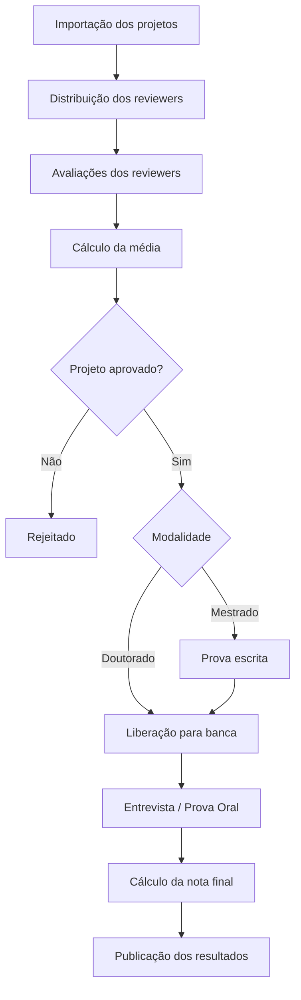

# PPGHIS Evaluation Process

Sistema de gerenciamento do processo de avaliação de projetos do Programa de Pós-Graduação em História (PPGHIS/UFRJ).

### Sobre o projeto

O PPGHIS Evaluation Process é uma aplicação desenvolvida para apoiar o processo seletivo de candidatos ao Programa de Pós-Graduação em História da UFRJ, automatizando o fluxo de distribuição, avaliação e consolidação dos resultados.

O sistema foi projetado para tornar o processo mais transparente, organizado e seguro, reduzindo atividades manuais e centralizando todas as etapas da seleção em uma única plataforma.

## Principais funcionalidades

### Autenticação

* Login por e-mail e senha
* Recuperação de senha

### Administração

* Gerenciamento de usuários
* Importação dos projetos submetidos
* Distribuição dos projetos entre os reviewers
* Acompanhamento do andamento das avaliações
* Registro da nota da prova escrita (Mestrado)
* Gerenciamento das etapas do processo seletivo
* Publicação dos resultados finais

### Review

Os projetos são distribuídos para três reviewers independentes.

#### Cada reviewer poderá:

* Visualizar apenas os projetos atribuídos
* Acessar o projeto submetido
* Preencher o formulário oficial de avaliação
* Atribuir uma nota ao projeto
* Salvar avaliações em rascunho
* Enviar a avaliação final

Após o envio das três avaliações, o sistema calcula automaticamente a média do projeto.

### Banca

Os projetos aprovados na etapa de review ficam disponíveis para a banca correspondente à modalidade.

Existem duas bancas independentes:

* Mestrado
* Doutorado

#### Cada banca poderá:

* Consultar os pareceres dos reviewers
* Consultar a média das avaliações
* Registrar a nota da entrevista/prova oral
* Registrar observações da banca

### Resultado Final

O sistema calcula automaticamente o resultado final conforme as regras do edital.

#### Doutorado

* Projeto — Peso 4
* Entrevista — Peso 6

#### Mestrado

* Projeto — Peso 2
* Prova escrita — Peso 4
* Entrevista — Peso 4

## Fluxo do processo

### Modelo do domínio

O sistema foi projetado seguindo princípios de Domain-Driven Design (DDD), mantendo o domínio organizado em entidades com responsabilidades bem definidas.

#### Principais entidades

* SelectionProcess
* Project
* ReviewForm
* ReviewAssignment
* Review
* WrittenExam
* CommitteeEvaluation
* FinalResult

### Controle de acesso

O sistema utiliza RBAC (Role-Based Access Control).

#### Papéis

* Administrator
* Reviewer
* Master Committee
* Doctorate Committee

#### Permissões

Projects

* projects.import
* projects.view
* projects.manage

Review

* review.assign
* review.evaluate
* review.submit
* review.update
* review.view-own
* review.results.view

Written Exam

* written-exam.record

Committee

* committee.evaluate
* committee.submit
* committee.update
* committee.results.view

Results

* results.view
* results.publish

Users

* users.manage

## Tecnologias

O projeto é desenvolvido utilizando tecnologias modernas do ecossistema Laravel.

* PHP
* Laravel
* MySQL
* Laravel Eloquent ORM
* Laravel Policies
* Laravel Queues
* Laravel Notifications
* Laravel Validation

### Arquitetura

O projeto adota uma arquitetura inspirada em Domain-Driven Design (DDD), buscando separar regras de negócio, casos de uso e infraestrutura para facilitar manutenção, evolução e testes.

### Objetivos

* Automatizar o processo seletivo
* Reduzir atividades manuais
* Garantir rastreabilidade das avaliações
* Centralizar toda a documentação do processo
* Padronizar o fluxo de avaliação
* Facilitar futuras evoluções do processo seletivo

## Licença

Este projeto foi desenvolvido para apoiar o Programa de Pós-Graduação em História da Universidade Federal do Rio de Janeiro (UFRJ).
